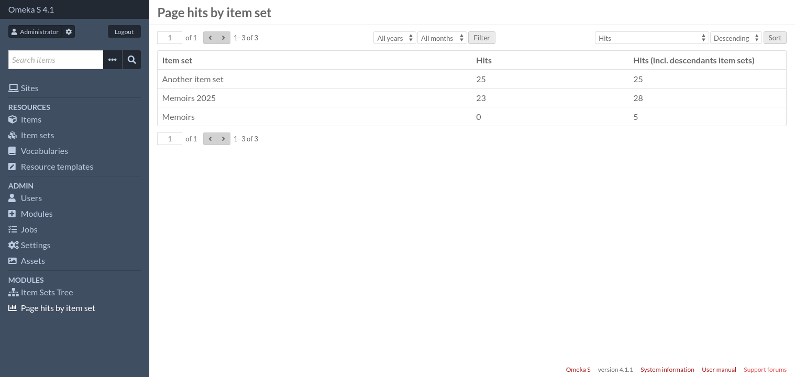

# Page Hits By Item Set

This [Omeka S](https://omeka.org/s/) module records the number of visits (hits)
on public item and media pages and groups them by item set.

It is a reimplementation of the collection tab from
[Omeka Classic plugin Stats](https://gitlab.com/Daniel-KM/Omeka-plugin-Stats)

## Requirements

* Omeka S 4.0.0 or greater

## Features

* Show the number of hits for each item set in a paginated table
    * Filter by year and/or month
    * Sort by number of hits
* If [ItemSetsTree](https://omeka.org/s/modules/ItemSetsTree/) is enabled, a
  new column displays the number of hits for an item set and all its
  descendants.
* Keep the database table small by storing only what's needed. Individual hits
  are not stored. The module stores only one row per item set / year / month

## Comparison with similar modules

[Statistics](https://omeka.org/s/modules/Statistics/) is a complete
reimplementation of
[Omeka Classic plugin Stats](https://gitlab.com/Daniel-KM/Omeka-plugin-Stats)
and as such is much more complete than this module.

It has a similar page that groups page hits by item set. There are a few
differences (this comparison is based on version 3.4.9 of Statistics):

* Statistics does not take into account ItemSetsTree
* Statistics stores individual page hits in database which can make the
  database grow rapidly
* Statistics provides an additional "date range" filter
